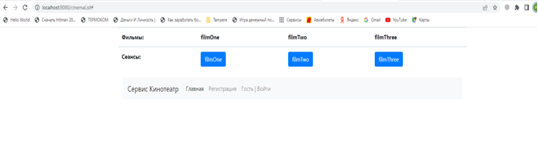
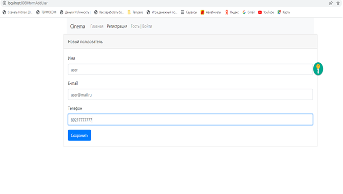
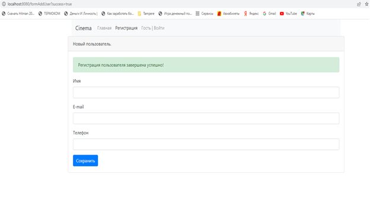
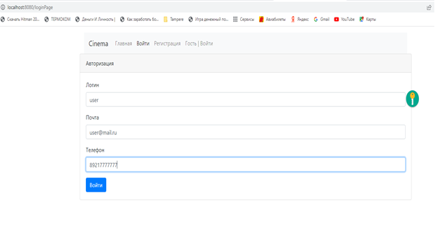
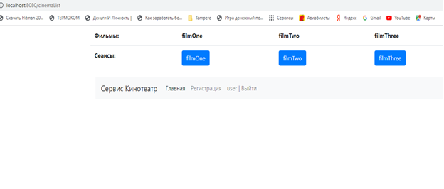
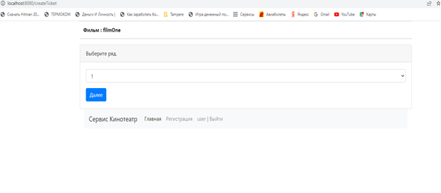
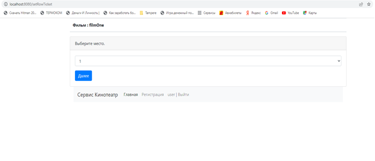
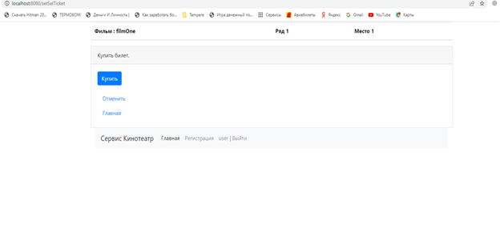
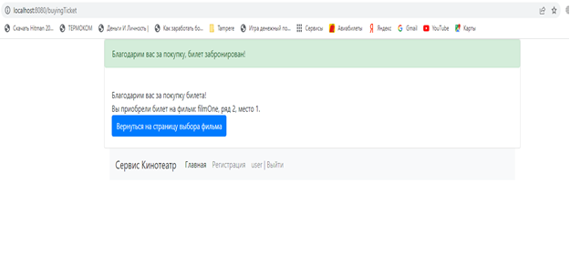
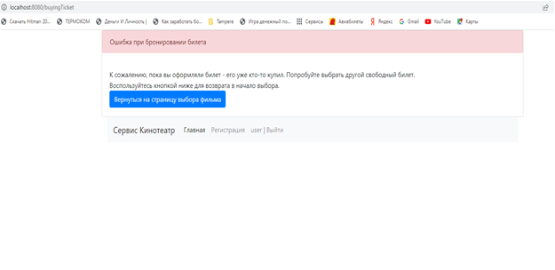

# job4j_cinema - Репозиторий Сергея Баранова.

Я прохожу обучение по курсу Job4j.

Ниже находятся наиболее интересные проекты, которые я реализовал во время обучения.

http://job4j.ru/

Цель проекта - освоить Java.

Проект "покупка билетов в кинотеатре".

В данном проекте реализован механизм выбора и бронирования билетов.

### Для запуска проекта :

1. Создать БД командой `create database cinema;` ;
2. Запустить приложение командой `mvn spring-boot:run;`

Скриншоты  web - интерфейса:

Чтобы выполнить какие - либо действия на сайте, 
необходимо выполнить регистрацию и авторизоваться.

Форма регистрации:

Далее мы выбираем название фильма и 
нажимаем на кнопку соответствующего сеанса.
Затем мы попадаем на страницу с выбором ряда.

Затем на страницу с выбором места.

И,наконец, попадаем на страницу , где мы можем забронировать билет,
либо вернуться в начало.

Если покупка прошла успешно, то мы увидим следующую страницу.

Если билет уже забронирован, то мы увидим такую страницу.

Далее мы можем вернуться на начальную страницу.

Стек технологий : Java 14; PostgreSQL 14.

Требования к окружению : Java 17, Maven 3.8, PostgreSQL 14.

Контакты : mariosb84@mail.ru .

