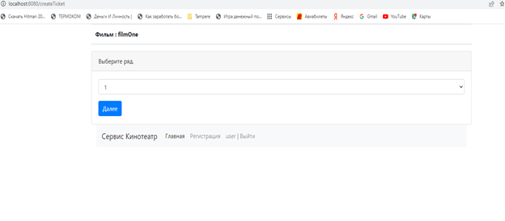
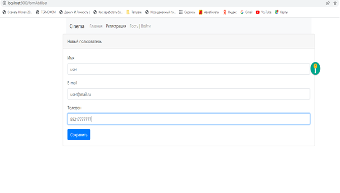
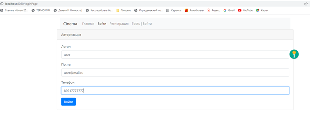
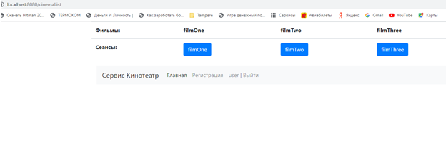
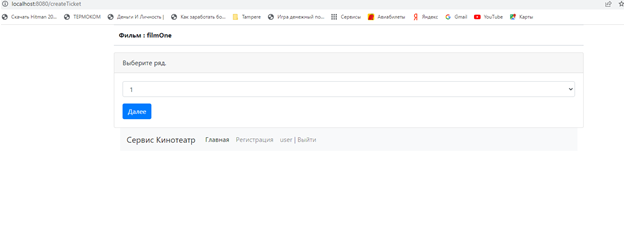
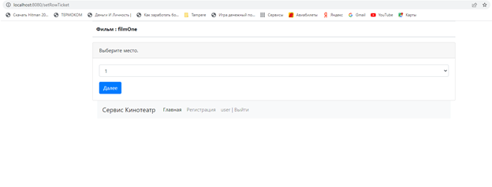
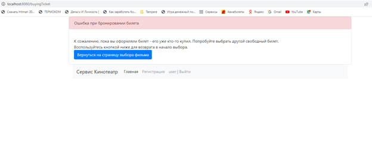

# job4j_cinema - Репозиторий Сергея Баранова.

Я прохожу обучение по курсу Job4j.

Ниже находятся наиболее интересные проекты, которые я реализовал во время обучения.

http://job4j.ru/

Цель проекта - освоить Java.

Стек технологий : Java 14; PostgreSQL 14.

Требования к окружению : Java 17, Maven 3.8, PostgreSQL 14.

Контакты : mariosb84@mail.ru .

